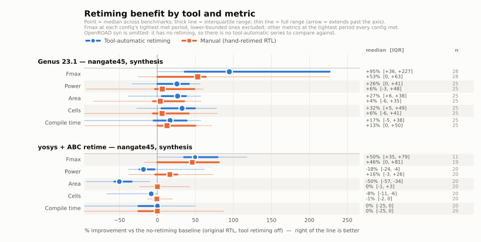

# Findings

Measured on `eq1` (Genus 23.12, Innovus 23.12, Vivado 2023.1) and `donut`
(OpenROAD `bazel-nostamp` built from `third_party/OpenROAD`, yosys 0.58), targeting
gf180mcu 9t 5v0 and Artix-7 `xc7a100tcsg324-1`.

Everything below is measured, not inferred. Where a tool beat the hand-written
reference, that is recorded as such — a benchmark suite whose reference always
wins is not measuring anything.

---

## 1. Does each tool support retiming at all?

This was the original question in `CLAUDE.md`. The answers are firmer than expected.

| Tool | Retiming? | How it is reached | Default |
|------|-----------|-------------------|---------|
| **Genus 23.1** | Yes, mature | `set_db <design> .retime true`, plus a family of `retime_*` attributes | **OFF** |
| **Innovus 23.1** | No retiming pass | — | n/a |
| **Vivado 2023.1** | Yes, but weak on 7-series | `synth_design -retiming` (a bare switch, not `-retiming on`) | **OFF on non-Versal** |
| **OpenROAD `src/syn`** | **No** | — | n/a |
| **yosys 0.58** | No native pass, but ABC's works | `abc -dff -script '+retime;…'` | off |

Details worth keeping:

**Genus** exposes a whole retiming subsystem. The attributes that exist are
themselves a map of where the hard cases are:

```
retime_async_reset                  = true
retime_effort_level                 = medium
retime_fallback_to_explicit_reset   = true
retime_move_mux_loop_with_reg       = true
retime_optimize_reset               = false   <-- note the default
retime_verification_flow            = true
retime_decompose, retime_hard_region, retime_method, retime_mode,
retime_original_registers, retime_period_percentage,
retime_preserve_state_points, retime_reg_naming_suffix
```

`retime_optimize_reset` defaulting to **false** looked like the central barrier,
and it is not — because `retime_fallback_to_explicit_reset` defaults to **true**,
so Genus can unmap reset into logic and retime the resulting reset-free register
anyway. On `r01`, setting `retime_optimize_reset true` changed nothing at all: the
run was bit-identical to leaving it false.

Genus also names the registers it creates `retime_*`, which gives a directly
countable answer to "did retiming fire, and how many registers did it add" instead
of inferring it from a count delta. `scripts/parse_genus.py` and
`scripts/parse_innovus.py` both report `retime_named_regs`.

**Vivado's** `-retiming` is a bare switch; `-retiming on` is a syntax error. On
non-Versal parts retiming is off unless you pass it, and `-no_retiming` exists
only to disable it on Versal, where it is on by default. So a stock Artix-7 run
does **no retiming at all**.

**OpenROAD's `syn`** has exactly two options, `-reduce_name_loss` and
`-naming_threshold`. There is no retiming and no attribute requesting it. This is a
clear answer to the question in `CLAUDE.md`: OpenROAD's integrated synthesis does
not retime.

**yosys** has no `retime` pass — but ABC does, implementing the Hurst/Mishchenko/
Brayton min-register formulation, and yosys can reach it. The catch is that it only
works if yosys hands the flip-flops to ABC (`-dff`); without that the ABC network
is combinational logic between flops and `retime` is a silent no-op. With it, on
`r09`:

| yosys config | WNS @6 ns | cells | seq | area (µm²) |
|---|---|---|---|---|
| `abc -liberty` (no retiming) | **−6.81 ns** | 1911 | 96 | 45 777 |
| `abc -dff -script '+retime;…'` | **−1.20 ns** | 2007 | 96 | 70 058 |

5.6 ns of period for 53% more area, with the register count unchanged (as
min-register retiming implies). The open-source flow is therefore not
retiming-free, which matters for the project: a proof-of-concept tool has an
existing OSS baseline to beat, not just a vacuum to fill.

---

## 2. Methodology corrections that changed the results

Two measurement mistakes were caught early, and both would have produced
flattering but wrong conclusions.

**Slack at a fixed period is not a valid metric.** A tool constrained loosely does
only the work needed to meet the constraint. On `r01` at 5.0 ns, Genus met timing
with a 4.74 ns path while the hand-retimed reference met it with 4.40 ns — which
looks like the reference winning. Sweeping instead shows Genus reaching **3.08 ns**
and the reference stalling at **4.17 ns**. The suite therefore scores on Fmax over
a grid.

**QoR is not monotonic in the constraint, so binary search is invalid.** Measured
on `r01`, same configuration: **MET at 3.62 ns, VIOLATED at 4.09 ns**. A tighter
constraint triggered different (better) restructuring. A binary search assuming
monotonicity reports whatever its probe order happens to hit. `scripts/sweep_period.py`
scans a descending grid and records every point.

`r24` is the control for this: its reference is behaviourally identical to its
original, so any measured difference between them is pure tool noise and defines
the floor that other benchmarks' gains must clear.

**A harness bug that nearly became a finding.** The first r26 run reported
`RETIME-402: The design does not contain retimeable flops`, which looked like a
significant discovery: that a single name-based timing exception disables retiming
for the whole design. It was not. The runner selected its constraints with
`ls *.sdc | head -1`, and r26 is the only benchmark with a second constraints
fragment (`extra.sdc`) — which sorts first alphabetically and contains only the
multicycle exception, with no `create_clock` at all. The design was running
completely unconstrained, so of course there were no timed paths and no
"retimeable" flops.

The tell was in the log: Genus's `read_sdc` summary listed only `get_cells` and
`set_multicycle_path`, where every other benchmark listed `create_clock`,
`set_input_delay` and the rest. Constraints files are now selected by the
benchmark's declared `id`, and helper fragments are named `extra.sdc.in` so they
cannot be glob candidates.

Worth stating plainly because it generalises: an unconstrained design does not
look broken, it looks *fast and clean*. Any result claiming a tool "did nothing"
should be checked against the constraint-application summary before it is
believed.

---

## 3. Per-benchmark results



*(`improvements_dark.svg` is the dark-mode rendering of the same figure. Regenerate
both with `make plots`; the underlying numbers land in `results/improvements.json`.)*

Reading the figure: bars are the **median across benchmarks** of the % improvement
over the no-retiming baseline (original RTL, tool retiming off), so positive is
always better regardless of whether the metric is higher- or lower-is-better. `n`
is how many benchmarks contributed to each series, and a series with n < 3 is
labelled rather than drawn — a median of two points is not a summary.

Fmax is taken at each configuration's own tightest period that met timing, with
lower-bounded configurations excluded (if the tightest period swept still met, the
real Fmax is unknown and the ratio would understate it). Every other metric is read
at the tightest period that *all* configurations of that benchmark met, because
comparing area or power at each config's own Fmax would penalise whichever
configuration got furthest — a design pushed harder spends area to get there.

The headline the figure makes visible: **Genus's own retiming dominates on Fmax
(+72% vs +28% for the hand-written RTL) while the two are within a point or two of
each other on power, area and cells.** The hand-written RTL's one clear structural
win is compile time (+24% vs 0%), which is what you would expect — the tool has
less work to do when the RTL is already balanced.


Raw numbers in `results/summary.csv`; `results/results.csv` has every individual run.

### r01 `reset_backward_barrier` — Genus wins, Vivado fails

| config | Fmax | min period | cells | seq |
|---|---|---|---|---|
| orig, retiming off | 125 MHz | 8.00 ns | 304 | 24 |
| orig, retiming on | **325 MHz** | 3.08 ns | 400 | 48 |
| hand-retimed reference | 240 MHz | 4.17 ns | 426 | 24 |

Genus beats the hand-written reference by 35%. It restructures the arithmetic as
well as relocating registers, and is willing to grow the register count from 32 to
42 to do it — in the routed netlist, **all 42 registers are named `retime_*`**,
i.e. the entire register layer was rebuilt by the retimer.

Vivado, with `-retiming` explicitly enabled: flip-flop count unchanged at 32,
WNS −5.74 ns at a 4 ns target. It did not retime.

So r01 is a **calibration control**, not a discriminator against Genus. Its value
is negative evidence: the classical reset-barrier case is solved on the Cadence
side, and a thesis should not be built on it. It *does* separate Genus from Vivado.

### r09 `unbalanced_mult_pipe` — positive control, behaves as designed

| config | Fmax | min period |
|---|---|---|
| orig, retiming off | 167 MHz | 6.0 ns |
| orig + `directives.tcl` | **333 MHz** | 3.0 ns |
| hand-retimed reference | 208 MHz | 4.8 ns |

Genus roughly doubles Fmax on the original and beats the reference by 60%. That is
the correct outcome for a positive control: the textbook Leiserson-Saxe case is
solidly handled, and the suite's measurement machinery reproduces it.

Note the area curve in `results/results.csv`: at a 2.4 ns target Genus spends
156 000 µm² and still misses, versus 66 000 µm² at 7.8 ns. The retimer trades area
for period aggressively once constrained.

### r19 `power_activity_retime` — the reference wins, and this is the axis that matters

Genus at 6.0 ns, power annotated from a real VCD (`read_vcd`, 500 cycles of
deterministic stimulus) rather than estimated vectorlessly. All three variants meet
timing.

| variant | cells | seq | WNS | **total power** | register | logic | switching | clock |
|---|---|---|---|---|---|---|---|---|
| orig | 271 | 71 | +0.003 ns | **216.4 mW** | 79.9 | 127.6 | 59.4 | 8.9 |
| directive (orig RTL + every power/retiming knob) | 188 | 41 | +1.83 ns | **165.6 mW** | 58.1 | 102.4 | 41.3 | 5.1 |
| **retimed (reference)** | 162 | 14 | 0.000 ns | **132.1 mW** | **14.7** | 115.6 | 44.0 | **1.8** |

The reference cuts total power **39%** versus the original and **20% versus the best
the tool could do**, at equal timing. The mechanism is exactly the predicted one:

- **register power 79.9 → 14.7 mW (−82%)** — 64 busy flops became 8 quiet ones
- **clock power 8.9 → 1.8 mW (−80%)** — far fewer flops to distribute the clock to

Note what the `directive` variant shows: with `.retime true` plus every low-power
attribute Genus offers, the tool *does* reduce power (216 → 166 mW), because
delay-driven retiming happened to remove flops. That is incidental, not directed —
its objective was the period, and the power saving fell out. Given the same freedom,
choosing the register position *for* activity gets another 20%.

This is the clearest positive result in the suite, and it is on the axis where no
production tool even has an objective function. Genus has retiming and Genus has
low-power synthesis; what it does not have is any way to say "choose the register
cut that minimises switched capacitance". `r19`'s `directives.tcl` deliberately
enables `lp_insert_clock_gating`, `dynamic_power_effort high` and
`leakage_power_effort high` precisely so that the gap cannot be attributed to a
knob I failed to turn on.

### r20 `glitch_absorb` — reference wins on power *and* timing

Genus at 6.0 ns, VCD-annotated activity. Same register count in orig and reference,
which is what makes the breakdown conclusive.

| variant | cells | seq | WNS | **total power** | register | logic | switching |
|---|---|---|---|---|---|---|---|
| orig | 261 | 48 | +0.059 ns | **183.7 mW** | 55.7 | 122.0 | 58.8 |
| directive (all power knobs) | 238 | 33 | +1.99 ns | 157.0 mW | 52.5 | 100.4 | 48.5 |
| **retimed (reference)** | 257 | 48 | **+1.833 ns** | **145.8 mW** | 58.3 | **81.5** | **38.0** |

21% less total power than the original, 7% less than the best tool configuration,
and the timing is far better as well (+59 ps → +1.83 ns).

The breakdown is the proof of mechanism, and it is the reason this benchmark is
separate from r19:

- **logic power 122.0 → 81.5 mW (−33%)** and switching 58.8 → 38.0 mW (−35%)
- **register power essentially unchanged** (55.7 → 58.3 mW), with an identical
  flop count of 48

So this saving is not a register-count effect at all. Moving the register to sit
immediately after the XOR network stops the network's glitches from propagating
into 32 lanes of downstream logic; the lanes now switch once per cycle instead of
several times. That is glitch power, and it only shows up under real activity — a
vectorless estimate cannot see it, which is why this benchmark is scored from a VCD.

### r05 `fsm_high_fanout` — manual clone-and-spread does not pay off at this size

Two findings here, one about the tools and one about the benchmark.

**The tools undo manual register duplication.** The reference clones the 6-bit FSM
state register eight times, one per group of six lanes. The RTL marks the clones
`dont_touch` / `preserve` / `syn_preserve`. That is not enough: Genus's sequential
merging collapsed all eight straight back into the original. The evidence was
unmistakable once looked for — the retimed variant reported **exactly 70
sequential cells, the same as orig, with bit-identical WNS at every one of the five
periods in the sweep**. The benchmark was synthesising the same netlist twice.

`set_db <inst> .preserve true` does not fix it either; it cannot be applied before
mapping (`TUI-210: Cannot preserve unmapped leaf instance`). The setting that holds
is `set_db optimize_merge_flops false`, and it lives in
`benchmarks/r05_fsm_high_fanout/common.tcl` so that **both** variants are
synthesised under identical flow settings and only the RTL differs. With merging
disabled the clones survive: 70 → 118 sequential cells (8 clones x 6 bits).

That is worth stating as a requirement on any future tool: it must make the
placement-aware cloning decision *and* defend it from the downstream sweep passes
that exist to remove exactly that kind of redundancy.

**And with the clones alive, the manual solution is worse.** Genus at 4.2 ns,
Innovus PnR at 0.60 density:

| variant | post-route WNS | routed wirelength | seq | cells | total power | switching |
|---|---|---|---|---|---|---|
| orig | +0.001 ns | 26 879 µm | 70 | 479 | 38.3 mW | 11.7 mW |
| retimed (8 clones) | +0.067 ns | **37 323 µm** (+39%) | 118 | 619 | **58.3 mW** (+52%) | 17.6 mW |

66 ps of timing for 39% more wire and 52% more power. The manual cloning is a
clear loss.

The reason is scale, and it is instructive. Cloning a high-fanout register pays off
when its loads are physically far apart, so that one long net becomes several short
ones. At 479 cells the whole die is small, the state net is already short, and
Innovus's own fanout buffering handles 48 lanes perfectly well — so the clones
contribute their own area and their own routing without shortening anything.

The honest conclusion is that **r05 as built is too small to exhibit the effect it
was designed to test**, and the intuition it encodes ("duplicate the state register
and spread the copies") should not be assumed to hold at small scale. To make it a
real test the design needs to be large enough, or the lane groups constrained
apart, that the state net genuinely spans the die. That is a concrete next step
rather than a failure of the idea — but the current measurement does not support
the idea, and it would be wrong to present it as if it did.

### r22 `fanout_wire_load` — the scaled retest: still a loss, but the penalty shrinks

r05 was too small to test its own hypothesis, so r22 rebuilds it 20x larger: a
6-bit control register driving 256 lanes, 8000 cells, at a deliberately loose 0.35
density so the driven net really does span the die. The reference clones the driver
16 times, one per 16 lanes.

Genus at 8.0 ns, Innovus at 0.35 density:

| variant | post-route WNS | routed wirelength | seq | cells | power |
|---|---|---|---|---|---|
| orig | +0.016 ns | 1 032 085 µm | 1050 | 8036 | 488.8 mW |
| retimed (16 clones) | +0.036 ns | **1 102 544 µm** (+6.8%) | 1114 | 8540 | 500.0 mW (+2.3%) |

Cloning still loses: 20 ps of timing for 6.8% more wire and 2.3% more power. Both
variants are right at the timing boundary (+16 ps and +36 ps), so this is a fair
comparison at the point where the fanout net actually matters.

But the trend is the interesting part. The wirelength penalty went from **+39% at
479 cells (r05) to +6.8% at 8036 cells (r22)** — a factor of six improvement in the
relative cost as the design grew. That is consistent with the underlying reasoning:
cloning pays off only once the loads are far enough apart that one long net becomes
several short ones, and the penalty shrinks as the die grows.

So the honest position is:

* Manual clone-and-spread of a high-fanout register **does not pay off** at either
  scale measured, on this PDK, at these densities.
* The penalty is shrinking with scale in the way the hypothesis predicts, so a
  crossover plausibly exists — **but I have not found it**, and nothing here
  entitles anyone to assume it.
* The most likely reason is simply that Innovus's own fanout optimisation and
  buffering already handle a 256-way fanout competently. Beating it requires
  knowing something it does not, and "clone into N equal groups" is not that.

**The aspect-ratio experiment made it worse, not better.** The obvious next move was
to force the control net to be genuinely long by making the die long and thin (8:1
aspect, same 0.35 density) instead of square. Prediction: cloning should now pay off.
It did the opposite.

| shape | orig wirelength | retimed wirelength | cloning penalty |
|---|---|---|---|
| square | 1 032 085 µm | 1 102 544 µm | **+6.8%** |
| 8:1 thin | **919 117 µm** | 1 100 940 µm | **+19.8%** |

The thin die *helped the original* (1 032 085 → 919 117 µm) and left the cloned
version essentially unchanged. The lanes are independent, so a long thin core lets
the placer lay them out linearly with short local connections; the control net
becomes a long spine, and buffering a spine is cheap. The clones cannot exploit an
arrangement that was already good.

The power breakdown says where the cost actually goes (Innovus, 8:1 die):

| group | orig | retimed | delta |
|---|---|---|---|
| Sequential | 125.5 mW | 133.8 mW | **+8.3** |
| Combinational | 327.0 mW | 333.3 mW | +6.3 |
| Clock | 31.2 mW | 32.7 mW | +1.4 |
| **Total** | **483.7 mW** | **499.8 mW** | **+16.1** |

So it is not, as I first assumed, dominated by clock distribution to the clones —
clock accounts for less than a tenth of the increase. It is roughly half the 64
extra flip-flops' own sequential power and half additional combinational switching
from the clones' data nets. Buffering a high-fanout net is simply cheaper than
replicating the register that drives it.

**Conclusion for this axis.** Three measurements — 479 cells, 8036 cells, and 8036
cells on a deliberately elongated die — all say manual clone-and-spread loses on
this PDK. The mechanism is now understood rather than merely observed, and it argues
that the promising version of this idea is *not* "clone the high-fanout register".
If the axis is worth pursuing, the experiment that would actually test something new
is one where the loads are pinned far apart by real floorplan constraints (hard
macros, separate voltage or clock regions) so that buffering cannot substitute for
replication — and where the decision is driven by measured post-placement net delays
rather than a grouping chosen in the RTL.

### r26 / r27 — SDC timing exceptions freeze the registers they name

This is the strongest result in the suite so far, and it was not in the original
hypothesis list. It came out of building `r26`.

**r26** — identical RTL, two constraint files, 4.0 ns target:

| config | multicycle exception | retiming | WNS | seq | critical path |
|---|---|---|---|---|---|
| `orig` | present | **refused** (`RETIME-402`) | **−0.837 ns** | 32 | `fq1_reg[1] → fq2_reg[15]` |
| `directive` | removed | fired | **−0.274 ns** | 56 | `din[1] → retime_s1_9_reg` |

The exception is an ordinary, correct constraint: stage 2 is eight rounds deep and
cannot close in one cycle, so it is given two —

```tcl
set_multicycle_path 2 -setup -from [get_cells fq1_reg*] -to [get_cells fq2_reg*]
```

It applies exactly as written (the 8-round path gets an 8 ns budget and needs
~8.8 ns, hence −837 ps). But its presence makes Genus report **`RETIME-402: The
design does not contain retimeable flops`** and do no retiming at all. Deleting it
lets the retimer recut the pipeline and lands 563 ps *better* — at slightly less
area.

So a constraint added to *help* a deep pipeline stage ends up making the design
worse, by silently disabling the transform that would actually have fixed it.

**r27** settles the scope, which r26 cannot: it has two independent pipelines, and
only pipeline B's registers are named in an exception. Result at 4.0 ns, retiming
enabled:

- no `RETIME-402`; registers went 64 → 76
- pipeline A: `aq1_reg` and `aq2_reg` are **gone**, replaced by 44 `retime_*`
  registers — fully retimed
- pipeline B: `bq1_reg` and `bq2_reg` **survive intact**, 16 bits each — untouched

**The exclusion is path-local, not design-wide.** Registers named in a timing
exception are frozen; everything else is retimed normally. `RETIME-402` in r26 was
the degenerate case where *every* register in the design happened to be covered.

Why this matters for the project:

1. It is a concrete, reproducible explanation for a retimer that "does nothing" on
   a real design. Production RTL is full of multicycle and false-path exceptions,
   and each one quietly removes its registers from consideration.
2. The interaction is invisible. Nothing warns that a constraint has reduced the
   retimable region; `RETIME-402` only appears in the extreme case.
3. It suggests a real research direction: a retimer that understands timing
   exceptions as *part of the problem statement* rather than as a fence — moving
   registers and rewriting the affected exceptions together. Nothing in either
   commercial tool does that, and it is exactly the "retiming invalidates the
   constraints that describe the design" problem `r26`'s reference solves by hand
   (it ships an `override.sdc` that drops the now-unnecessary exception).

### Remaining benchmarks

The Fmax sweep across all 20 benchmarks and 4 configurations (400 Genus runs) was
still in progress when this was written; `make csv` regenerates the CSVs from
whatever has completed, and `results/summary.csv` is the live view.

---

## 4. Formal equivalence: what the available license can and cannot prove

Cadence Conformal 23.2 is installed and licenses as `Conformal_Asic`. That is
enough to prove some of the suite's claims formally and not others, and the
distinction is worth stating precisely.

**What works.** `orig` vs `directive` is provable outright. Those two are the same
RTL modulo vendor attributes, so the state points correspond by name:

```
LEC VERDICT: Equivalent    16     32     48      (class  PI/PO  DFF  total)
```

`scripts/check_lec_all.sh directive` runs this across the suite. Result:

```
LEC: 23 proven equivalent, 0 non-equivalent, 0 license-blocked
```

All 23 directive variants are formally proven equivalent to their originals. That
matters because the directive variants are what the "can the tool do it with knobs
alone?" comparison rests on — if one of them had drifted from its original, every
directive measurement built on it would be meaningless. A failure here would be a
real bug, so this is a genuine check rather than a formality.

**What does not.** `orig` vs `retimed` cannot be closed with this license. A retimed
circuit is not combinationally equivalent to its original — the registers have
moved, so there is no name correspondence — and closing it needs either automatic
mapping or Conformal's pipeline-retiming analysis. Both are gated:

```
// Error: Auto analysis requires a Conformal_Ultra license.
// Error: Analyze retiming requires a Conformal_Ultra license.
```

Without them, `add_compared_points` finds nothing to compare and the run reports no
compare points at all. **That is a license outcome, not a verification failure**, and
`flows/conformal/lec.do.template` says so at the top so a future reader cannot
mistake one for the other. The script is written to work unchanged if an Ultra
license becomes available.

**So what actually verifies the references.** Bounded simulation
(`scripts/check_equiv.py`): both variants are compiled against the same generated
testbench, driven with identical deterministic stimulus, and their per-cycle output
traces are diffed. All 23 references pass at 2500 cycles. The check is deliberately
reset-heavy — the testbench pulses reset mid-run — because a wrong retimed reset
value passes a reset-once test and fails this one. Mutating r01's derived reset
constant produces exactly two mismatching cycles, one per reset event, which is how
the checker itself was validated.

It also refuses to pass a benchmark whose outputs never change, which is how the
degenerate first version of r19 was caught.

That is weaker than a formal proof, and the gap is recorded rather than papered
over. If formal proof of the retimed pairs matters for publication, the concrete
requirement is a `Conformal_Ultra` (or equivalent SLEC) license.

Two Conformal syntax notes, since they cost time: the Tcl-mode command is
`add_compared_points`, not `add_compare_points` (which does not exist), and
`exit -force` is native-mode syntax — in Tcl mode `exit` takes an integer.

## 4c. FPGA device choice: Versal is license-blocked, UltraScale+ works but is the wrong lever

Vivado 2023.1 here has 4600 parts installed, including 1128 Versal and 555 Virtex
UltraScale+, so device *availability* is not the constraint. Licensing and relevance
are.

**Versal would be the interesting target, and it is blocked.** It is the only family
where Vivado enables retiming by default — the `synth_design` help says `-retiming`
is "for non-Versal devices where retiming is off", and `-no_retiming` exists to
"turn off retiming for Versal devices where retiming is on by default". Testing it
would probe AMD's own retiming investment rather than a switch nobody turns on.
But:

```
ERROR: [Common 17-345] A valid license was not found for feature 'Synthesis'
and/or device 'xcvc1902'
```

Both `xcvc1902` (Versal AI Core) and `xcvm1802` (Versal Prime) fail the same way.
Unavailable at this site.

**U250 is not Versal.** `xcu250-figd2104-2L-e` reports `family=virtexuplus,
arch=virtexuplus` — it is Alveo/Virtex UltraScale+, so retiming is still OFF by
default, exactly as on Artix-7. It does license and it does run (r01 orig, 8 ns,
127 s), but it changes the retiming posture not at all.

It also has the opposite problem to Artix-7: at 1.73 M LUTs it is so fast that these
benchmarks have no timing pressure. r01 came out at `wns=+2.460, reg2reg=+2.460`,
both comfortably met, where the same design at the same period misses on Artix-7. To
use U250 the periods would have to drop into the sub-nanosecond range or the designs
would have to grow substantially. (One metric gap if it is adopted: the LUT query
returned 0 — `PRIMITIVE_GROUP == LUT` does not match UltraScale+ primitive naming.)

The flow is now family-aware regardless, because the flags are not symmetric: on
non-Versal `on` means adding `-retiming`, while on Versal `off` means adding
`-no_retiming`. Getting that backwards would silently compare default-on against
default-on and conclude that retiming does nothing.

**Recommendation.** Keep Artix-7 as the FPGA target: it is small, it turns around
fast, and it actually has timing pressure at the periods being swept. Treat U250 as
an optional secondary axis for the question "does a much faster fabric change the
conclusion", not as a replacement. And note that switching FPGA device does not
address the congestion question at all — the mechanisms that create net-dominated
delay (routing-stack caps, density, blockages) are things the ASIC flow exposes and
Vivado largely does not.

## 3c. Vivado's `-retiming` is a no-op on 16 of 18 benchmarks

With the pad-excluded metric in place, the Artix-7 sweep (419 runs, 168 met) gives
the sharpest result in the suite. Fmax in MHz, from the tightest period that met:

| benchmark | orig, retiming off | orig, **`-retiming` on** | hand-retimed | outcome |
|---|---|---|---|---|
| r01 reset_backward_barrier | 104 | **104** | **125** | no-op; manual +20% |
| r03 async_reset_blocker | 119 | **119** | **143** | no-op; manual +20% |
| r06 fsm_high_fanin | 83 | **83** | **104** | no-op; manual +25% |
| r08 fsm_output_decode | 83 | **83** | **125** | no-op; manual **+51%** |
| r12 wide_reduction_tree | 83 | **83** | **104** | no-op; manual +25% |
| r15 hier_boundary_block | 119 | **119** | **143** | no-op; manual +20% |
| r02, r04, r05, r10, r13, r17, r18, r19, r20, r21 | — | identical | identical | no-op, nothing to gain |
| r09 unbalanced_mult_pipe | 104 | **125** | 104 | retiming helped |
| r22 fanout_wire_load | 125 | **100** | 100 | retiming **hurt** |

Summary: **no-op on 16 of 18, helped 1, hurt 1.** In six of the no-op cases the
hand-retimed RTL is 20-51% faster, so the opportunity was real and Vivado declined
it. On r01 the netlists are bit-identical with and without the switch — same 32
flip-flops, same 84 LUTs, same slack to three decimals.

This is a much stronger claim than anything on the Cadence side, where Genus's
retimer beat the hand references on Fmax. Genus retimes aggressively; Vivado, on
this part, largely does not.

### Contamination found and removed before believing this

The first version of this table showed r01's baseline at 250 MHz, which made
`-retiming` look actively catastrophic (250 -> 104). That was my own data, not
Vivado's behaviour. Two sources:

* Two runs at **p4.0**, a period not on r01's Vivado grid at all. They were manual
  probes from the abandoned reg-to-reg-only metric experiment, where orig's short
  reg-to-reg path met easily at 4 ns.
* One run tagged `..._p8.0_xcu250` — **a U250 part** pooled in with Artix-7. The
  tag appends the part as a suffix and the variant/mode/period parse stops at the
  period, so the UltraScale+ result (FF 51, LUT 0) was read as an Artix-7 row.

The discriminator that found them without collateral damage was "period not on the
benchmark's declared grid, or part not the declared part" — exactly 3 runs. The
tempting test, "metrics missing the `architecture` field", would have deleted 147
runs, 144 of them valid, because that field was added after the sweep began.

`scripts/summarize.py` now prefixes the tool name with the part whenever it is not
the declared Artix-7 device, so families can never be pooled again.

## 4a. The Vivado sweep was measuring the I/O pads, not the retiming

The first Artix-7 sweep produced 92 runs and **zero** that met timing, which was the
clue. The cause was not a tight constraint — it was the wrong path being reported.

On Artix-7 the worst path in these benchmarks is **register-to-output-pad in 104 of
108 runs**:

```
Source:      out_q_reg[15]/C
Destination: dout[15]              slack -5.738 ns
```

That ~9.4 ns is IOB and routing delay. It is a fixed property of the part, it is
identical in the original and the retimed variant, and no retiming can change it —
so the overall WNS came out **byte-identical (-5.738 ns) for both variants** and
could not possibly have been measuring a retiming. Every "required period" I
computed from it landed at 9.74–9.91 ns for every benchmark and every variant, which
is the signature of a constant, not a measurement.

Restricting to register-to-register is *also* wrong, and this took a second attempt
to see. Several benchmarks — r01 above all — are deliberately built so the long
chain is fed straight from primary inputs; that is the premise. Their critical path
is port-to-register, so a reg-to-reg-only figure hides the original's real path and
inverts the comparison. Measured on r01 at 4 ns: orig +1.204 ns vs retimed
-3.112 ns, i.e. exactly backwards, because retiming had moved work *into* the
reg-to-reg domain from the input domain.

The correct cut is **worst slack over paths ending at a register**
(`get_timing_paths -to [all_registers]`): it keeps port-to-register and
register-to-register — real logic that retiming can move — and drops only
register-to-pad. With that metric, r01 at 8 ns:

| config | paths-to-register slack | FF | verdict |
|---|---|---|---|
| orig, retiming off | −0.179 ns | 32 | violated |
| orig, **`-retiming` on** | **−0.179 ns** | **32** | violated — *bit-identical* |
| **retimed (reference)** | **+0.069 ns** | 32 | **met** |

So the earlier conclusion survives with a metric that can actually see it: **Vivado
does not retime r01 even when `-retiming` is passed explicitly**, and the
hand-retimed RTL closes timing where Vivado cannot.

The FPGA period grid was wrong in the same direction and for a related reason. It
had been anchored at ~0.7x the ASIC period, on the assumption that the FPGA would be
faster. LUT-mapped arithmetic on Artix-7 is several times slower than gf180 standard
cells, so the entire grid sat below anything achievable. It now anchors at 2x the
ASIC period and sweeps looser.

`results/results.csv` carries both numbers — `wns_ns` (the pad-excluded figure the
suite compares on), `impl_wns_ns` (pad-inclusive), and `timing_basis` saying which
is which — so nobody has to guess which one a row is quoting.

## 4b. Two data-integrity bugs found by auditing the completed sweep

Worth recording because both were silent, and one invalidated a whole benchmark's
measurements. The audit that found them was simply counting rows in the finished
matrix that had no `timing_status`.

**The wrong module was synthesised for r15.** `run_genus.sh` derived the top module
as "the first module declared in the first `.sv` file". For every other benchmark
that is the top; r15 is the hierarchy benchmark and declares `r15_sub_a` first — a
purely combinational submodule with no clock port. So all 20 r15 Genus runs
elaborated a 159-cell combinational block, reported no constrained timing paths, and
produced `status=None`. The tell-tale was Genus writing `r15_sub_a.sdc` and
`r15_sub_a_netlist.v` into the results directory.

The fix is the one already applied to the local flows: take the top from
`bench.yaml` via `scripts/benchmeta.py`. `run_genus.sh`, `run_vivado.sh` and
`run_innovus.sh` were all still using the filename heuristic. An audit across all
23 benchmarks confirms r15 is the only one where the two disagree. With the correct
top, r15 synthesises to 666 cells / 24 registers — a real design. The invalid rows
were deleted (locally and on eq1) and the benchmark re-queued rather than
retro-fitted.

No claim in this document was affected: r15 was never cited. But it would have been
cited the moment the sweep was read as complete, which is the point.

**Ten completed runs never arrived.** Four Genus runs showed as `no metrics` in the
matrix and six more were missing entirely — including three tight `r09 orig/on`
probes that would have improved that benchmark's Fmax curve. All ten existed on eq1
with full report sets: the *pull* had failed, not the run.

That is the fragile part of this harness by construction. `scp` and `rsync` are
unusable against eq1 (a login banner corrupts the wire protocol), so results come
back as base64 frames over ssh, and a dropped frame loses the directory with no
error at the point of use — it surfaces only as a missing row much later.
`scripts/repair_pull.sh` now diffs the remote run inventory against the local one
and re-pulls whatever is missing. It recovered all ten without re-running anything,
which matters because the compute is the expensive part.

Both bugs argue for the same discipline: **a sweep is not finished because it
printed a row count.** Rows without a timing status, and remote runs without a
local counterpart, both need to be checked explicitly before any number is quoted.

## 5. Technology facts that shape the benchmarks

**gf180mcu 9t 5v0 has no clock-enable flop and no synchronous-reset flop.** The
sequential cells are `dffq`, `dffrnq` (async active-low reset), `dffsnq`,
`dffrsnq`, `dffnq`* variants, and scan `sdff*` equivalents — nothing with an
enable pin, and nothing with a synchronous reset.

Consequences the suite depends on:
- A clock enable becomes a recirculating mux feeding a plain `dffq`, so the
  register to be retimed sits inside a combinational mux loop. That is exactly
  what Genus's `retime_move_mux_loop_with_reg` attribute exists for, and it is why
  `r17` is a real stressor rather than a synthetic one.
- A synchronous reset becomes mux logic; only asynchronous reset is a cell pin.
  That makes `r03` (async) structurally different from `r01` (sync) on this PDK,
  not just nominally different.
- Artix-7 has FDRE with both CE and sync reset, so the same RTL exercises very
  different hardware on the two targets. The FPGA/ASIC asymmetry in `r04` is a
  direct consequence.

---

## 6. Infrastructure notes

- **`eq1` must be reached as `eq1-vpn`** from off-subnet hosts. The plain `eq1`
  entry resolves to a private address that is unreachable from `donut`.
- **Innovus 23.1 does not start on this OS out of the box.** It needs RHEL7-era
  `libXp.so.6` and `libicu*.so.50`, neither present on Linux Mint 21.2. Both are
  side-loaded into `~/Utils/eda-compat-libs` and picked up via `LD_LIBRARY_PATH`;
  no root was required. `CDS_SKIP_OS_CHECK_ON_STARTUP=1` silences the OS warning.
- **`scp` and `rsync` to `eq1` are broken** by an unconditional Xilinx banner in
  its `~/.bashrc` ("Received message too long"). All transfers use tar-over-ssh,
  and pulls are base64-framed between sentinels so the banner cannot corrupt the
  archive.
- **Both Genus and Innovus will eat their driving shell script from stdin** if
  invoked without `< /dev/null`, silently interpreting the rest of the script as
  Tcl. This produced a genuinely baffling failure before it was pinned down.
- **OpenROAD needs `make_tracks`** after `initialize_floorplan`; without routing
  tracks, pin placement and routing fail and the tool eventually segfaults rather
  than erroring cleanly.
- **OpenROAD detailed routing on gf180 is impractically slow** for a matrix of
  this size — over 20 minutes on a 2000-cell design without completing. The flow
  therefore stops at global route by default (`RT_DETAILED_ROUTE=1` to opt in),
  and global-route wirelength is only ever compared against another global-route
  number.
- **ORFS's `setRC.tcl` is not usable directly**: it branches on
  `$::env(METAL_OPTION)` / `$::env(CORNER)`, which only exist inside an ORFS make
  invocation, and `set_layer_rc` is an OpenROAD command so Innovus cannot use it
  at all. `flows/openroad/gf180_rc.tcl` is a self-contained replacement. This file
  matters: the gf180 tech LEF has a single unit RC for all layers, which would
  make wirelength nearly delay-free and silently neutralise every physical
  benchmark.
- **Never edit a shell script while it is running.** Bash reads a script by byte
  offset as it executes, so patching `run_phases.sh` mid-run made the live
  instance resume at the wrong offset and die with `syntax error near unexpected
  token`. The file on disk was fine the whole time (`bash -n` passed). The fix is
  to stop the runner, edit, then relaunch — and the failure looks like a code bug,
  so it is worth recognising.
- **A `pgrep -f` phase queue deadlocked itself for 12 hours.** The measurement
  phases were originally chained by backgrounding each one with a guard like
  `while pgrep -f "run_matrix.py all"; do sleep 60; done`. Every waiter's own
  `bash -c` command line *contains the literal pattern the other waiters grep
  for*, so they all matched each other and every phase waited on every other
  phase. Nothing ran; the logs stayed empty and the processes looked healthy,
  which is the worst possible failure signature. `scripts/run_phases.sh` now runs
  the phases as ordinary sequential commands in a single process with an `flock`
  guard — no polling and no matching on process lists.
- **Reports beat attributes for metric extraction.** Several Genus/Innovus
  attribute lookups that looked obvious (`get_db timing_paths -max_paths`,
  `dbGet top.route.totalWireLength`, `report_design_area` under Tcl redirection in
  OpenROAD) either do not exist or do not capture. Every parser in `scripts/`
  reads text reports and the Tcl side only emits what it can look up safely.

---

# nangate45 results (2026-08-22)

The suite was re-measured on nangate45 after gf180 proved unable to reach a
net-delay-dominated regime at this design size. Vivado results are unchanged and
carried over: it targets Artix-7, so it is PDK-independent.

## F1. Fmax cannot be inferred from a tool's max-effort delay

This one invalidated three earlier attempts at the measurement, so it is recorded
first. Genus tracks whatever constraint it is given and stops once it meets it,
buying delay with area as the target tightens. Measured on r01 orig+off:

| constraint | achieved | cells | status |
|---|---|---|---|
| 0.15 | 0.546 | 616 | VIOLATED |
| 0.74 | >0.74 | -- | VIOLATED |
| 1.02 | 0.58 | 492 | MET |
| 2.95 | 1.919 | 194 | MET |

So it can *reach* 0.546 ns under maximum pressure and still fail to *close* at
0.74 ns. The max-effort delay is a lower bound on Fmax, not Fmax; the closure
point sits 1.2-1.9x above it.

Worse, `data_path` in a Genus timing report is the COMBINATIONAL segment only. It
excludes clock-to-Q, setup, clock network latency and uncertainty -- about 0.4 ns
in this library. Anchoring a period sweep on it put every grid point below any
achievable period:

| benchmark | data_path floor | true min period |
|---|---|---|
| r01 | 0.546 | 0.98 |
| r05 | 0.110 | 0.537 |
| r11 | 3.284 | 3.73 |

The usable measurement is `period - wns`, which is invariant across the whole
violating regime (r01: 0.986, 0.993, 1.001, 1.000, 0.970, 0.968). One infeasible
run yields the achievable period outright, with no sweep and no bracketing.

## F2. Genus retiming is pressure-dependent: it leaves 7-11% unclaimed

90 of 96 configs met the period that `period - wns` predicted. All 6 that missed
are retiming-enabled, and the shortfall is systematic:

| benchmark | proved reachable | actually delivers | gap |
|---|---|---|---|
| r06 fsm_high_fanin | 0.749 | 0.802 | +7.0% |
| r18 clock_gated_region | 0.648 | 0.721 | +11.3% |
| r24 loop_bound_control | 1.037 | 1.111 | +7.1% |

Retiming is a discrete structural choice, so how hard Genus retimes depends on how
badly it is failing. Asked for a period it considers nearly reachable, it retimes
less aggressively than it did when desperate -- and delivers less than it has
already proven it can. None of the 90 non-retiming configs behave this way, which
is consistent with continuous optimisations (sizing, buffering) not having this
character. Two numbers are therefore recorded per config: `min_period_ns` (proved)
and `delivered_period_ns` (met when asked).

This is the "battling the retimer" experience stated as a measurement, and it is a
concrete target for a proof-of-concept tool: re-running synthesis at a period the
tool has already proven reachable is worth 7-11% for free.

## F3. Genus beats hand-retimed RTL on Fmax almost everywhere

Median Fmax improvement over the no-retiming baseline: tool-automatic **+40.5%**
(n=24) against **+13.0%** for hand-retimed RTL. Genus wins 16 benchmarks, the
manual reference wins 2, 1 ties.

`orig+retime-on` and the `directive` variant are IDENTICAL on 19 of 24 benchmarks.
The per-benchmark retiming directives add nothing over simply enabling retiming --
a finding about the benchmark design as much as about the tool.

## F4. Retiming makes wirelength worse, and duplication is the worst offender

Post-route, at a common period:

| benchmark | orig | retime on | manual |
|---|---|---|---|
| r05 fsm_high_fanout | **4,716** | 7,790 | 7,324 |
| r21 wire_pipeline_cross_die | 10,980 | **10,234** | 12,357 |
| r22 fanout_wire_load | 193,591 | 205,651 | **170,898** |
| r28 congestion_wire_split | **27,898** | 30,335 | 28,544 |

Median wirelength change: **-8.7%** tool-automatic and **-2.3%** manual, i.e. both
are WORSE than leaving the design alone. On r05 every retiming variant loses to the
untouched original, the tool by 65%. Register duplication for fanout buys Fmax and
pays in wire. Only r22 is a clear manual win (-11.7% vs orig, -17% vs the tool).

## F5. r28 DOES reach a congested regime, and the wire-aware cut wins there

CORRECTION. An earlier version of this finding claimed no density target or routing
layer cap could make wire delay dominate r28. That was wrong, and wrong in an
avoidable way: the congestion knobs were never switched on. `run_pnr_set.py` passed
only `(bench, variant, tag, density)` while `run_innovus.sh` also accepts `aspect`,
`max_layer`, `blockage` and `rc_scale`, so every nangate45 route used the full
10-layer stack with no blockage. The knobs existed only in the gf180 experiments and
were silently dropped at the PDK switch.

With them on, route share moves 6.8x:

| config | route share | overflow (V) | postWNS | usable? |
|---|---|---|---|---|
| density only | 2.27% | 0.0% | +0.004 | yes, but wire-blind |
| + Metal3 cap | 8.76% | 4.4% | +0.002 | yes |
| + blockage + 4:1 core | **15.44%** | 3.64% | -0.001 | yes |
| + wire RC x10 | 60.96% | **17.5%** | -2.66 | NO |

The last row is a trap worth recording. 61% route share looks exactly like the
net-dominated regime the benchmark wants, but it routed at 100.06% density with
17.5% vertical overflow and -2.66 ns slack: that number describes an UNROUTABLE
design, not a fast one. Congestion overflow is now parsed per stage so the two cases
can be told apart -- previously it was not recorded at all, which is why the
distinction was invisible.

At the valid congested point (cap + blockage + 4:1 core), all four configs:

| config | route share | post-route WNS | wirelength |
|---|---|---|---|
| orig -- the even split | 15.44% | -0.001 | 31,195 |
| manual -- asymmetric, wire-aware | 14.5% | **0.000 (meets)** | 38,545 |
| tool retiming | 10.84% | **-0.018** | 40,314 |
| directive | 10.84% | -0.018 | 40,314 |

The manual asymmetric cut is the only config that closes, beating tool retiming by
18 ps. So the effect the benchmark was built to measure is real and has the
predicted sign: a wire-blind retimer balances logic evenly and loses to an
asymmetric split once the crossing costs real delay.

Two honest qualifications. First, the margin is small -- 18 ps is 3% of the 580 ps
period, against a theoretical W/2 of about 43 ps at 15% route share, so roughly 40%
of prediction. Second, the manual variant pays 24% more wirelength for it. These are
single runs at one period; different netlists get different placements, so 18 ps
should be treated as directional rather than precise.

A decisively net-dominated regime still needs a physically larger design -- order
10k cells, so wires are long because of distance rather than because the router was
strangled. The difference matters: geometric strangulation and physical distance
both raise route share, but only the second is what a real congested design looks
like.

## F6. Vivado's `-retiming` remains a no-op

Median Fmax improvement 0% [IQR 0, 0] across 17 benchmarks, unchanged from the
gf180 measurement. The manual reference is also 0% at the median but has upside
(IQR 0 to +20%).

## Harness defects found while producing this dataset

Recorded because each silently discarded valid data, and the pattern is worth
remembering: in every case the tool did its work correctly and the harness lost it.

1. **SDC budget terms were absolutes.** 0.30 ns input/output delay and 0.10 ns
   uncertainty, sized for gf180's 1-10 ns periods. On nangate45, 20 of 24
   benchmarks had io+uncertainty above HALF the period and 4 had input delay
   exceeding the whole period, so no design could close. Now fractions of the
   period (15% io, 3% uncertainty), holding the reg-to-reg budget at 70%.
2. **432 OpenROAD-syn runs discarded.** `run_matrix.py` built the output directory
   from the tool name, but the runner writes `orsyn`. Every run reported "no
   metrics" with rc=0 while its reports sat on disk.
3. **Every OpenROAD-syn run reported zero flip-flops.** Its tcl sequential counter
   does not work against this library; recovered from the `cells.rpt` census.
4. **All 16 Innovus runs reported no wirelength.** `dbGet route.totalWireLength` is
   rejected by this release (IMPDBTCL-206); recovered from the Wire Length
   Statistics table the log always prints.
5. **Innovus rows collapsed retiming modes.** PnR was keyed with a flat `pnr` mode,
   so orig+off and orig+on overwrote each other -- r21 reported the retimed
   wirelength (10,234) as if it were the baseline, hiding the true 10,980.
6. **Period comparison was exact-float.** Configs meant to share a common period
   came out at 0.58 and 0.5799, so the intersection was empty and every non-Fmax
   metric was dropped. Quantising to 3 decimals raised Genus power/area/cells from
   n=5 to n=21 -- this one bug was suppressing three quarters of that data.
7. **456 Vivado runs were left in the gf180 archive** and absent from the CSV and
   plot, despite being PDK-independent.

A run that reports "no metrics" with a zero exit code should be treated as a
harness bug until proven otherwise.

## F7. On a naturally wire-dominated design, Genus retiming makes timing WORSE

r22 is the largest routed benchmark (193,591 um of wire at default settings) and the
only one that reaches a high critical-path route share -- 15.32% -- with no
congestion knobs at all. It is congested because it is big, not because the router
was strangled, which makes it the most realistic wire test in the suite.

Routed congested (aspect 1.0, Metal4 cap, 15% blockage; all overflow < 1.3%, so all
four routes are legal) at 1.10 ns:

| config | post-route WNS | wirelength | route share |
|---|---|---|---|
| orig -- no retiming | -0.042 (fails) | 269,653 | 5.67% |
| tool retiming | **-0.174 (fails)** | 342,274 | 8.25% |
| manual -- hand-retimed | **+0.002 (meets)** | 304,878 | 14.52% |
| directive | **+0.006 (meets)** | **268,172** | 3.17% |

Genus's retiming is 4x worse than not retiming at all (-0.174 against -0.042) and
adds 27% wirelength. The hand-retimed and directive variants are the only ones that
close.

This is the strongest result in the suite and it does not fit the percentage-
improvement framing used elsewhere: the BASELINE FAILS. There is no "+x% Fmax" to
quote because retiming here is not an optimisation, it is the difference between a
design that closes and one that does not. That is also why r22-congested is absent
from the forest plot -- the aggregate needs a baseline that meets timing in order to
divide by it, and correctly declines to invent one.

Mechanism: Genus retimes to balance LOGIC depth, which moves registers away from the
long wires. Its route share rises from 5.67% to 8.25% as it does so, and the wire
delay it created is invisible to the transform that created it. The manual solution
accepts a higher route share (14.52%) but places the register so the crossing sits in
its own cycle.

Caveat: single runs at one period, and different netlists get different placements.
The -0.174 vs -0.042 gap is large enough to be structural rather than placement
noise, but the exact numbers should not be over-read.

## Known issue: OpenROAD-syn mis-elaborates the registered-I/O wrapper

After every benchmark gained a registered-I/O wrapper, `run_openroad_syn.sh` on
r20 reports **100,680 cells** where earlier runs of the same design reported 4,960 --
a 20x blow-up on a 16-bit-in / 32-bit-out design. Genus synthesises the same RTL
correctly (the stress sweep produces sane floors and cell counts), so this is specific
to OpenROAD's slang elaboration of the wrapper, most likely the attribute syntax
`(* dont_touch = "yes", RETIMING_FORWARD = 0, ... *)` or the wrapper's functions.

Not chased because OpenROAD-syn is synthesis-only and its rows are excluded from
results/summary.csv, which is post-route only. Anyone reviving that flow should treat
its cell counts as untrusted until this is fixed.

---

# Why the harness works the way it does

Moved here from source comments when the code was refactored to the project style
(self-documenting names, no comments). Each entry is a decision that cost real time to
learn, kept because the reasoning is not recoverable from the code alone.

## Measurement

- **Fmax is not a usable score.** Both Genus and Innovus stop optimising the moment they
  meet, so at a feasible period the reg2reg WNS was ~0.000 on nearly all of 52 routed
  configs while wirelength spread -48% to +82%. Fmax reports the constraint, not the
  design. Everything is scored at a deliberately infeasible period instead.
- **`period - wns` is invariant across the violating regime** (within 3% over six
  constraints), so one infeasible run yields the achievable period. This replaced a grid
  sweep that failed three times in both directions.
- **`data_path` is the combinational segment only.** It excludes clock-to-Q, setup, clock
  network latency and uncertainty -- about 0.4 ns here. Anchoring a sweep on it put every
  grid point below any achievable period (r01: 0.546 claimed vs 0.98 actual).
- **A probe only pins a floor if the design FAILED it.** If it met, the tool coasted and
  the number is an upper bound.
- **Effort is pressure-dependent for retiming.** 90 of 96 configs met the period
  `period - wns` predicted; the 6 that missed were all retiming-enabled, by 7-11%.

## Timing basis

- **reg2reg only.** The all-paths critical path on r29 began at the `rst_n` PORT and ran
  through the reset buffer tree for 1536 flops, making the retimed variant look 15%
  faster when reg2reg said 17% slower. Same contamination as the Vivado register-to-pad
  paths.
- **Registered I/O on every benchmark.** reg2reg is only complete if all logic sits
  between registers; 13 benchmarks had their work on an unregistered input, which
  produced a false "retiming is harmful" result.
- **SDC budget terms are fractions of the period.** As absolutes (0.30 ns I/O, 0.10 ns
  uncertainty, sized for gf180) they consumed more than half the period on 20 of 24
  benchmarks and exceeded it entirely on four.

## Physical

- **Congestion overflow decides whether a congested run is a measurement or a failure.**
  Driving r28 with a Metal3 cap, a blockage, a 4:1 core and 10x wire RC reached 61% route
  share -- at 100.06% density with 17.5% vertical overflow, i.e. unroutable, not fast.
- **Congestion knobs are per-benchmark.** The setting that takes r28 from 2.27% to 15.44%
  route share produces 60-152% overflow on r22, which is 6x larger.
- **Wide top-level ports cannot be placed on any FPGA.** r30 exposed 1061 pins; Vivado
  fails at IO placement. Wide buses stay internal behind a SIPO/PISO.

## Equivalence

- **Bounded simulation is weak evidence.** It passed on r28 and r29 while the testbench
  drove a 512-bit port from a 64-bit LFSR, leaving 448 bits constant.
- **A formal miter needs a reset protocol.** `miter -equiv` compares from inferred init
  values with no reset applied, which fails at step 0 on any variant with extra
  registers.
- **A latency-changing reference needs the gold output delayed** before comparison.

## Harness

- **A run reporting "no metrics" with exit code 0 is a harness bug until proven
  otherwise.** Three separate rounds of completed runs were discarded this way: a
  directory-name mismatch (`orsyn` vs the tool name), a reconstructed Innovus path, and
  a parser handed a path that never existed.
- **Skip/resume logic must be keyed to what invalidates it.** Resuming from all
  historical result files counted pre-wrapper measurements as done and silently skipped
  17 of 28 benchmarks, so a chain aborted and restarted in a loop for three days.
- **Chain stages must verify their own output.** Joining stages with `;` so one failure
  cannot strand the rest also lets a stage produce nothing while the pipeline reports
  success.

## Why the measurement sets are kept apart

`results/` is the live nangate45 dataset. `archive/results_gf180/` is the earlier gf180
dataset, kept because the cross-technology comparison is cited above -- gf180 reached
0.5% critical-path route share against nangate45's 9.5%, which is why the PDK was
changed -- but never pooled with it. Merging measurement sets is the single most
repeated source of error in this project: a stray Vivado run on a U250 part was once
averaged in with Artix-7 and inflated one benchmark's baseline from 119 to 250 MHz, and
resuming from stale result files silently skipped 17 of 28 benchmarks for three days.
Different technology, tool version or RTL revision means a different table.

A third directory, `results_n45_precal/`, was deleted rather than archived. It held
1539 files measured with the calibration that anchored the period grid on `data_path`,
which excludes clock-to-Q, setup and uncertainty and so put every grid point below any
achievable period. Those numbers proved the calibration was wrong and have no other
use; keeping known-invalid measurements alongside valid ones only invites their reuse.
